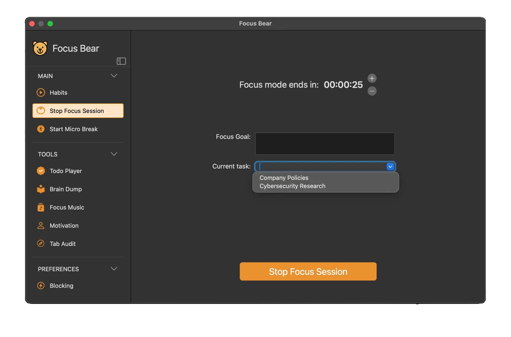

# Focus Bear Bug Report & UX Observations

**Reporter:** Sannidhya Roy (Mac Developer Intern)

**Period of Observation:** 11th May 2026 onwards (ongoing)

**Mac App Version:** v3.31.474 (MacBook Pro M1 2020, macOS 15 Sequoia)

**Android App Version:** v1.19.0 (Samsung Galaxy S24, Android 16)

---

## Preface

These observations were made during my first weeks as a Mac Developer Intern, approaching the app as a genuine new user without prior knowledge of the codebase. Some issues are clear bugs with reproducible steps. Others are architectural observations or UX gaps. All are documented as specifically as possible.

## Routine Configuration (`Edit Habits > Timing`)

| **Screenshot** |
| :------------: |
|  |
| *Daily schedule as configured during observation period. Morning Routine starts at 7:00 AM, Evening Routine at 3:00 PM, Tech Curfew at 12:00 AM. The schedule view calculates Evening Routine end as 3:19 PM based on total habit durations (19 minutes), placing Sleep from 3:19 PM onward, a scheduling model assumption discussed further in the observations note below.* |

## A Note on the Nature of These Bugs

Several bugs in this report are not isolated incidents. They appear to share roots in a common underlying problem: the app's time window and state management logic is inconsistent across platforms and across app states.

`BUG-MAC-05` and `BUG-AND-02` are the same bug on different clients, suggesting backend time validation is broken. `BUG-AND-03` (incorrect completion state) is likely a symptom of the same broken state. `BUG-MAC-06` (wind down at 3PM) is probably another manifestation. The evening routine being completable after midnight (`BUG-AND-02`, `BUG-MAC-05`) means completion events are being recorded against the wrong day, which could cause cascading state corruption elsewhere.

The scheduling model also raises deeper questions. The daily schedule view shows Evening Routine ending at 3:19PM because the app calculates end time as start time plus the sum of habit durations. This assumes habits start exactly on time and take exactly their set duration, neither of which is realistic. In practice the app seems more flexible than this, but the rigid calculation in the schedule view suggests the underlying model may not match the actual behavior, which could be a source of the time window bugs.

These bugs individually look like small issues. Together they suggest the time and state management layer deserves a focused audit.

---

## macOS

### BUG-MAC-01: Focus Session Block List Selection is Wrong Entry (Geek Mode)

**Severity:** High

**Type:** Off-by-one index bug

**Description:**
In Geek Mode, when starting a Focus Session and selecting a block list, the block list that is actually enforced during the session is different from the one selected.  Focus Logs confirm this further, showing the recorded block list entry is one position above the actually selected item in the dropdown.

For example, selecting "Locked Focus on current activity" (index 5) runs the session in "Work" focus mode (index 4), which is confirmed by the tooltip shown when hovering over the Focus Bear menu bar icon during the session.

**Evidence:**
- Selecting "Deep Work" (index 1) records "Block super distracting sites/apps" (index 0)
- Selecting "Work" (index 4) records "Manual Entry" (index 3)
- Selecting "Locked Focus on current activity" (index 5) records "Work" (index 4)

**Steps to Reproduce:**
1. Ensure the app is in Geek Mode
2. Start a Focus Session
3. Select any block list other than the first option
4. Complete or stop the session
5. Check Focus Logs

**Expected Result:**
Focus Logs record the block list that was actually selected.

**Actual Result:**
Focus Logs record the block list one position above the selected one.

**Suspected Cause:**
Off-by-one error in the index mapping between the selection UI and the Focus Log recording logic.

| **Screenshot 1** | **Screenshot 2** |
| :--------------: | :--------------: |
|  |  |
| *Focus Bear Blocklist selection dropdown in `Start Focus Session` with "Locked Focus on current activity" selected* | *Tooltip confirms "Work" focus mode is active, despite "Locked Focus on current activity" was selected by the user* |

---

### BUG-MAC-02: `FBHelper` Process Persists After Quitting Focus Bear

**Severity:** Low

**Type:** Transparency / UX Bug

**Description:**
Quitting Focus Bear via the menu does not terminate the `FBHelper` background process. The helper continues running indefinitely, consuming memory and triggering scheduled habit popups even when the user believes Focus Bear is completely closed.

**Steps to Reproduce:**
1. Launch Focus Bear
2. Quit via `Focus Bear status bar app > Quit`
3. Check Activity Monitor that no Focus Bear process visible
4. Run `ps aux | grep -i focus` in Terminal

**Expected Result:**
All Focus Bear processes terminate on quit.

**Actual Result:**
FBHelper continues running:
```bash
sannidhyaroy  76641  /Applications/Focus Bear.app/Contents/Resources/FBHelper.app/Contents/MacOS/FBHelper
```
Process started since last restart and ran continuously for days. Memory usage approximately 50MB (sometimes, this can go upto 65-80MB), fluctuating as kernel does not immediately reclaim allocated memory.

**Impact:**
Users have no visible indicator that Focus Bear is still active and controlling their machine after quitting. No menu bar icon, no dock badge, no notification. The only way to fully terminate is via `kill <PID>` in Terminal, which is not a reasonable expectation for the target audience.

| **Screenshot** |
| :------------: |
|  |
| *Activity Monitor showing Resource Consumption of `FBHelper`* |

**Suggested Fix:**
`FBHelper` likely runs intentionally to deliver scheduled habit reminders even when the main app is closed. If so, this behavior should be transparent and user-controllable rather than silent. Suggested approaches:

- Add a persistent menu bar icon that remains visible whenever `FBHelper` is running, making it clear the app is still active in the background, with a "Fully Quit Focus Bear" option that terminates both processes
- Or add a user-facing setting explaining that Focus Bear keeps a lightweight background process running for habit reminders, with an option to disable this behavior
- A "Did you know?" style tip during onboarding or first use could also surface this proactively, so users are never surprised by it

---

### BUG-MAC-03A: Completed Todo Items Appear in Focus Session Task Suggestions (Simple Mode)

**Severity:** Low-Medium

**Type:** Data Filtering Bug

**Description:**
In Simple Mode, when starting a Focus Session, the "Current task" dropdown suggests tasks that have already been marked as complete in the Todo List. A similar issue exists in the AI distraction check popup during active focus sessions (see `BUG-MAC-03B`).

**Steps to Reproduce:**
1. Ensure the app is in Simple Mode
2. Mark one or more tasks as complete in Todo List
3. Start a Focus Session
4. Click the "Current task" dropdown

**Expected Result:**
Only incomplete tasks appear in the dropdown.

**Actual Result:**
Completed tasks appear alongside incomplete ones with no visual distinction.

| **Screenshot** |
| :------------: |
|  |
| *Both tasks shown are completed, yet shown as dropdown suggestions* |

---

### BUG-MAC-03B: Completed Todo Items Appear in AI Distraction Check Popup Task Dropdown

**Severity:** Low

**Type:** Data Filtering Bug / UX Question

**Description:**
During an active Focus Session, when opening an app that the AI considers potentially distracting, a popup appears asking the user to pick a task to guide Focus Bear. The "New task" dropdown in this popup includes tasks that have already been marked as complete in the Todo List.

This may be intentional if the intent is to allow users to re-select a completed task, but it is worth confirming. If intentional, a visual distinction between completed and incomplete tasks in the dropdown would reduce confusion. A similar issue exists in the Simple Mode Focus Session screen (see `BUG-MAC-03`).

**Steps to Reproduce:**
1. Mark one or more tasks as complete in Todo List
2. Start a Focus Session
3. Open an app that the AI flags as potentially distracting
4. Observe the "New task" dropdown in the popup

**Expected Result:**
Either only incomplete tasks appear, or completed tasks are visually distinguished from incomplete ones.

**Actual Result:**
Completed tasks appear alongside incomplete ones with no visual distinction.

| **Screenshot** |
| :------------: |
|  |
| *"Company Policies" and "Cybersecurity Research" are both completed tasks appearing in the New task dropdown* |

---

### BUG-MAC-04: Work Emergency Unlock Duration Not Communicated

**Severity:** Low-Medium

**Type:** UX / Transparency Issue

**Description:**
The "Work Emergency - start focusing" button during Wind Down mode grants only a short temporary unlock, but this duration is never communicated to the user before or after tapping. The Focus Session then ends abruptly when the emergency unlock expires with no warning.

**Observed Durations:** 27 minutes, 7 minutes, 10 minutes across different sessions.

**Additional Context:**
The button is placed under an "Up early?" section alongside "Start morning routine", which implies it is for early risers rather than a timed emergency override. If the unlock is intentionally time-limited, the duration should be clearly stated before the user commits to it.

**Steps to Reproduce:**
1. During Wind Down, tap "Work Emergency - start focusing"
2. Start a Focus Session
3. Observe the session ending prematurely without warning

**Expected Result:**
Unlock duration is clearly communicated. A warning appears before the session is forcibly ended.

**Actual Result:**
Session ends at an unexpected time. Wind Down screen reappears immediately, before the user can even view session stats.

**Suggested Fix:**
Display the unlock duration on the button or in a confirmation dialog before tapping. Show a warning countdown before the session is forcibly ended.

| **Screenshot** |
| :------------: |
|  |

---

### BUG-MAC-05: Evening Routine Available After Midnight

**Severity:** High

**Type:** Time Window Validation Bug

**Description:**
After midnight (12:00AM), when Wind Down should be the active time window, the Evening Routine remains interactive and allows users to check off habits. This bug is also confirmed on Android (see `BUG-AND-02`), suggesting the root cause is in the backend time window validation logic rather than any individual client.

**Steps to Reproduce:**
1. Set up Evening Routine habits
2. After 12:00AM, open Focus Bear
3. Observe Evening Routine section

**Expected Result:**
Evening Routine is greyed out after its time window ends, similar to how Morning Routine correctly shows "Starts at 7:00AM" when inactive.

**Actual Result:**
Evening Routine remains interactive after midnight. Habits can be checked off. Completion state is also inconsistent as sometimes it shows habits as uncompleted even when done, correcting itself only after app restart/refresh.

| **Screenshot 1** | **Screenshot 2** |
| :--------------: | :--------------: |
|  |  |
| *Notice the screen appears after 12 AM (note the time)* | *Clicking on `Start Evening Routine` brings to this page and lets you complete them at midnight* |

**Note:** Since this affects both macOS and Android independently, the bug is likely in shared backend/API time window validation rather than client-side code.

---

### BUG-MAC-06: Wind Down Screen Triggered 9 Hours Before Tech Curfew

**Severity:** High
**Type:** Time Window / State Management Bug

**Description:**
At 3:03 PM, after my Focus Session ended, I marked all my evening habits as done. Then started my micro-break, and suddenly the Wind Down completion screen appeared with the message "Well done finishing your evening routine" and "Your sleep time is 12:00 AM", despite the tech curfew being set to 12:00 AM (9 hours later). The sidebar showed a tooltip "Disabled because it's your shutoff time", confirming the app believed it was shutoff time.

Simultaneously, the micro-break countdown ("Your break ends in 20:55") was correctly running in the top right corner. The app was in two contradictory states at once: active focus break (correct) and Wind Down (incorrect).

**The Cascade of Questions This Raises:**

This bug surfaces a series of deeper questions about the app's scheduling model that are worth documenting:

1. Evening Routine start time is set to 3:00 PM. But what is the end time? The daily schedule view shows Evening Routine ending at 3:19 PM, which is exactly the sum of all evening habit durations (19 minutes). So the app calculates end time as `start time + total habit durations`

2. This assumption means the app expects every user to start their habits at exactly 3:00 PM sharp, and that every habit will take no longer than its configured duration. Neither is realistic

3. In practice, the app is more flexible than this. Evening Routine habits can be completed at 7 PM without issue on normal days. So the rigid schedule calculation does not match the actual enforced behavior. The model and the behavior are inconsistent

4. On this particular day, marking all evening habits as done at 3:03 PM appears to have triggered the Wind Down state immediately, as if the app interpreted "all habits complete" as "evening routine window is over, proceed to next time window." The next time window in the schedule is Sleep, which runs from 3:19 PM to 7:00 AM. Tech curfew is 12:00 AM, but the schedule model places Sleep starting at 3:19 PM

5. So the most likely explanation is: completing all evening habits early caused the app to advance to the next scheduled time window (Sleep/Wind Down) immediately, ignoring the configured tech curfew entirely

6. This only happened once. On normal days finishing evening habits early does not trigger Wind Down. So there is likely an additional condition or race condition that caused this specific instance, but the underlying scheduling model creates the conditions for it to happen

**Steps to Reproduce:**
Not consistently reproducible. Observed once at 3:03 PM after completing all Evening Routine habits shortly after the routine start time.

| **Screenshot** |
| :------------: |
|  |
| *Wind Down screen at 3:03 PM with micro-break popup simultaneously visible, 9 hours before the configured tech curfew of 12:00 AM* |

**Notes:**
This is not a simple isolated bug. It is a symptom of a scheduling model where the calculated schedule (based on habit durations) does not match the actual enforced behavior (based on tech curfew time), and under certain conditions the calculated schedule wins. The result is an app that can lock a user out of their computer mid-workday because they finished their evening habits efficiently which is the opposite of what a productivity app should do.

See also `UX-02` for the related UX concern around communicating these behaviors proactively, and the "A Note on the Nature of These Bugs" section for broader context on how this connects to other issues in this report.

---

## Architectural Observations (macOS)

### ARCH-01: WebView Per Dashboard Tab

**Type:** Performance Concern

**Observation:**
Several features in the macOS app are implemented as embedded WebViews loading `dashboard.focusbear.io` rather than native AppKit/SwiftUI views. Affected tabs include `Todo List`, `Motivation`, `Edit Habits`, `Help and Support`, and others. Each tab spawns a separate WebView process when first opened.

**Evidence from Activity Monitor:**
```
https://dashboard.foc...  584.3 MB virtual   3.4 MB real
https://dashboard.foc...  115.8 MB virtual   2.6 MB real
https://dashboard.foc...  111.5 MB virtual   2.2 MB real
https://dashboard.foc...  107.8 MB virtual  15.5 MB real
https://dashboard.foc...   92.8 MB virtual   2.4 MB real
https://dashboard.foc...   91.4 MB virtual   7.9 MB real
```
Six separate WebView processes consuming over 1.1GB virtual memory combined.

| **Screenshot 1** | **Screenshot 2** |
| :--------------: | :--------------: |
|  |  |
| *Activity Monitor showing resource consumption of Focus Bear processes* | *Prolonged use of Focus Bear will have excessive resource consumption* |

**Suggested Direction:** This is an intentional architectural decision to share code between the web dashboard and the Mac app. The trade-off is a significant memory footprint, particularly on memory-constrained machines like an 8GB MacBook. If the current architecture is retained, using a single shared `WKWebView` with navigation between tabs rather than spawning separate instances per feature would reduce the memory overhead without requiring a full native rewrite. This is offered as a suggestion rather than a criticism as the trade-off between code sharing and native performance is a reasonable product decision.

---

### ARCH-02: Excessive Port Usage on Main Process and FBHelper

**Type:** Performance and Security Concern

**Observation:**
Both the main Focus Bear process and the FBHelper background process consistently hold an unusually high number of open ports, even when no active focus session or blocking is in progress.

**Evidence:**

| Process | Virtual Memory | Real Memory | Threads | Ports | PID |
|---------|---------------|-------------|---------|-------|-----|
| Focus Bear (main) | 182.2 MB | 38.8 MB | 17 | 1,016 | 75544 |
| FBHelper | 77.7 MB | 12.8 MB | 4 | 244 | 76641 |

| **Screenshot 1** | **Screenshot 2** |
| :--------------: | :--------------: |
|  |  |
| *Main Focus Bear process holding 960 ports in Activity Monitor* | *`FBHelper` holding 244 ports independently, which runs persistently in the background* |

**Suspected Cause:**
`PusherSwift` framework (found in the app bundle's `Frameworks` directory) maintains persistent WebSocket connections for real-time features. `NWWebSocket` is also present in the bundle, and the interaction between the two may be causing redundant or unclosed connections. Confirmed with Manish that `Pusher` is a continuous service; `NWWebSocket` usage is under investigation.

**Performance Impact:**
macOS has a system-wide file descriptor limit. An application holding 1,000+ ports is unusual and suggests connections are not being properly closed or pooled. This may contribute to system instability under load, and combined with the WebView memory usage (see ARCH-01), places significant resource pressure on the system.

**Security Impact:**
Beyond performance, excessive open connections expand the app's attack surface. Each open socket is a potential entry point, and redundant or improperly closed connections may hold authentication tokens in memory longer than necessary. If any connections lack proper TLS or authentication, focus session data, habit data, or credentials could be at risk of interception. FBHelper's 244 open ports are particularly notable given it runs as a persistent background process even when the user believes Focus Bear is fully quit.

## Android (v1.19.0)

### BUG-AND-01: Focus Logs Not Syncing

**Severity:** High

**Type:** Data Sync Bug

**Description:**
Focus Sessions completed on Android do not appear in Focus Logs / Stats. The same workflow on macOS correctly records and displays focus session logs.

**Steps to Reproduce:**
1. Disconnect other platforms, except Android to perform the test in isolation
2. Start and complete a Focus Session on Android
3. Navigate to `Stats > Other stats > Focus Log` on Android
4. The newly completed Focus Session isn't logged in Focus Log.

**Expected Result:**
Focus session appears in Focus Logs on all platforms.

**Actual Result:**
Focus sessions completed on Android are missing from Focus Logs.

**Impact:**
Focus Logs are used to track and demonstrate productivity. Missing logs on sessions completed on Android mean users who primarily use the mobile app have no verifiable record of their focus sessions.

---

### BUG-AND-02: Evening Routine Available After Midnight

**Severity:** High

**Type:** Time Window Validation Bug

**Description:**
After midnight (12:00AM), when Wind Down should be the active time window, the Evening Routine remains interactive on Android and allows users to check off habits. Morning Routine is correctly greyed out with "Starts at 7:00AM", but Evening Routine does not apply the same time window enforcement.

This bug is also confirmed on macOS (see `BUG-MAC-05`), suggesting the root cause is in shared backend/API time window validation logic rather than any individual client.

**Steps to Reproduce:**
1. Set up Evening Routine habits on Android
2. After 12:00AM, open the app
3. Observe that Morning Routine is correctly greyed out but Evening Routine remains
   interactive

| **Screenshot 1** | **Screenshot 2** |
| :--------------: | :--------------: |
|  |  |
| *After 12 AM, Evening Routine still remains interactive* | *Morning Routine is correctly greyed out, Evening Routine should ideally be greyed out too* |

---

### BUG-AND-03: Evening Routine Shows Incorrect Completion State

**Severity:** Medium

**Type:** UI State Consistency Bug

**Description:**
The Evening Routine sometimes shows habits as incomplete even when they were previously marked done. The correct completion state is restored only after closing and reopening the app.

This was observed after completing Evening Routine habits in the early hours of the morning via `BUG-AND-02`. The habits were marked done around 1:00AM, and the app was opened multiple times between then and 5:59AM showing the correct completed state. At 5:59AM, the habits appeared incomplete again without any user action. Whether this state inconsistency also occurs when habits are completed within the correct evening time window has not been confirmed.

**Steps to Reproduce:**
Not consistently reproducible. The state inconsistency was observed in conjunction with `BUG-AND-02`. Closing and reopening the app consistently restores the correct state in most cases, when the bug occurs.

**Expected Result:**
Completed habits remain marked as done consistently without requiring an app restart.

**Actual Result:**
Evening Routine habits appear incomplete despite previously being marked done. Closing and reopening the app restores the correct state.

| **Screenshot 1** | **Screenshot 2** |
| :--------------: | :--------------: |
|  |  |
| *Habits showing as incomplete at 5:59AM despite being completed hours earlier* | *After closing and reopening the app, habits correctly show as completed* |

---

### BUG-AND-04: Subtask Checkbox Toggles All First 4 Subtasks Together

**Severity:** High

**Type:** List State Management Bug

**Description:**
When a task has more than 4 subtasks, tapping the checkbox of any of the first 4 subtasks toggles all 4 of them simultaneously instead of only the tapped one. Subtasks beyond index 4 appear unaffected.

**Steps to Reproduce (not consistently reproducible):**
1. Create a task with more than 4 subtasks
2. Tap the checkbox of any of the first 4 subtasks

**Expected Result:**
Only the tapped subtask is toggled.

**Actual Result:**
All 4 of the first subtasks toggle simultaneously.

**Suspected Cause:**
List view recycling issue where the first 4 subtask items share the same view holder state or checkbox binding, causing them to act as a single togglable group.

**Screen Recording:**

https://github.com/user-attachments/assets/fd93d874-b4dd-4490-a000-c5a422319436

---

### BUG-AND-05: "Detailed Logging" Toggle Hit Target Requires Row Tap Instead of Toggle Widget

**Severity:** Low

**Type:** UI Interaction Bug

**Description:**
In Settings, the "Enable detailed logging" toggle does not respond to tapping directly on the toggle widget. The user must tap the entire row to trigger the toggle.

**Steps to Reproduce:**
1. Navigate to Settings in the Focus Bear app on Android
2. Tap `Help` and find `Enable detailed logging`
3. Tap directly on the toggle switch

**Expected Result:**
Toggle activates on tap.

**Actual Result:**
Toggle does not respond. Tapping the row text area activates it instead.

**Screen Recording:**

https://github.com/user-attachments/assets/0f86644f-08d1-415f-aa24-3f78c6c64e1a

---

### BUG-AND-06: Bearsona Reverts to Default OG Bear Intermittently

**Severity:** Low

**Type:** State Persistence Bug

**Description:**
The selected Bearsona occasionally reverts to the default "OG Bear" despite a different one being set. The correct Bearsona reappears after some time without user intervention.

**Steps to Reproduce:**
Not consistently reproducible. Occurs intermittently after either few hours or days.

**Suspected Cause:**
Race condition between local state and server sync. The app likely displays a cached default while fetching the user's preference from the server, and updates when the fetch completes.

| **Screenshot 1** | **Screenshot 2** |
| :--------------: | :--------------: |
|  |  |
| *Set a Bearsona, apart from the default OG Bear* | *Come back a few hours or days later, and Bearsona reverts back to OG Bear* |

---

## Web ([`dashboard.focusbear.io`](https://dashboard.focusbear.io))

### BUG-WEB-01: Profile Picture and Description Changes Not Saved

**Severity:** Medium

**Type:** Missing Save Functionality

**Description:**
The profile section on the web dashboard allows editing profile picture and description, but has no Save button and does not auto-save. Changes are lost on navigation or page refresh.

**Steps to Reproduce:**
1. Open `dashboard.focusbear.io`
2. Click on the Profile icon on the bottom-left corner, then click `Profile`
3. Edit profile picture or description
4. Note there is no button to save state
5. Navigate away or refresh

**Expected Result:**
Changes are either auto-saved or a Save button is provided.

**Actual Result:**
Changes are silently discarded with no warning.

| **Screenshot** |
| :------------: |
|  |
| *Changes are neither auto-saved, nor is a save button present to update the changes* |

---

### BUG-WEB-02: Stats / Activity Hidden Behind Logo Click

**Severity:** Medium

**Type:** Navigation / UX Bug

**Description:**
The Stats and Activity section is not accessible from the sidebar navigation. It is only reachable by clicking the Focus Bear logo to return to the home page. There is no "Stats", "Activity", or equivalent menu item in the sidebar.

**Steps to Reproduce:**
1. Log in to `dashboard.focusbear.io`
2. Note the stats screen that loads
2. Try to find Stats or Activity from the sidebar

**Expected Result:**
Stats are accessible from the sidebar navigation like any other core feature.

**Actual Result:**
Stats are accessible at `dashboard.focusbear.io`, which is only via logo click, which is a non-obvious and unconventional navigation pattern. Several users, including myself, gave up searching before accidentally discovering the path.

| **Screenshot** |
| :------------: |
|  |
| *Statistics doesn't have a dedicated sidebar menu and is accessible from `dashboard.focusbear.io` only via the logo* |

**Suggested Fix:**
Add a dedicated "Stats" or "Activity" item to the sidebar navigation.

---

### BUG-WEB-03: Blog Post Header Overlaps Article Content on Scroll

**Severity:** Medium

**Type:** CSS Layout Bug

**Description:**
On blog post pages, the blog post title element overlaps the article body content when scrolling, making the text illegible.

**Steps to Reproduce:**
1. Open any blog post on [focusbear.io/blog](https://www.focusbear.io/blog)
2. Scroll down

**Expected Result:**
Title stays above content or scrolls away naturally. Article body is fully readable.

**Actual Result:**
Title overlaps article body text, making it unreadable.

| **Screenshot 1** | **Screenshot 2** |
| :--------------: | :--------------: |
|  |  |
| *Focus Bear sample blog post* | *Blog posts after scrolling* |

---

## UX Observations

*These are not bugs but UX gaps that caused genuine confusion as a first-time user.*

### UX-01: Conceptual Relationship Between Habits, Focus Sessions, and Schedurunsled Blocking Not Explained

**Description:**
Focus Bear has three distinct but overlapping concepts for managing time and focus:

- **Habits:** routine-based tasks that run during Morning or Evening Routine windows
- **Focus Sessions:** manual, on-demand blocking for ad hoc deep work, with
  task and subtask tracking, micro-breaks, and a focus score
- **Scheduled Blocking:** time-based automatic blocking that runs on a set schedule,
  like work hours

Their relationship, intended use cases, and the consequences of using one instead of another are never explained anywhere during onboarding. The onboarding sets each of these up in sequence without first giving the user a mental model to reason about them.

This is the most foundational UX gap in the app. Everything else like feature locking, Wind Down triggering, stats, mode differences becomes significantly harder to navigate without understanding this foundation first.

**Impact:**
New users cannot make informed decisions about which feature to use for which purpose. As an example: The absence of Focus Log entries on Android (`BUG-AND-01`) is a result of exactly this as it appeared that Focus Sessions were not being tracked at all, making it unclear whether they were even the correct tool to use or a bug. In practice, Focus Sessions should save Focus Logs but a new user is unclear if it really is a bug or not.

Focus Sessions support task and subtask tracking, micro-breaks, and a focus score, but a new user going through onboarding would have no idea these capabilities exist, let alone when to use them over Scheduled Blocking.

| **Screenshot** |
| :------------: |
|  |
| *Onboarding asks to set up habits without ever explaining what habits are or how they differ from Focus Sessions or Scheduled Blocking* |

**Suggested Fix:**
A single screen early in the post-login onboarding explaining the three concepts and when to use each would prevent the majority of first-week confusion. This is also an opportunity to surface what each app mode (Cuddly Bear and Grizzly Bear) enables, and how features like task/subtask tracking, focus logs, AI blocking differ between these three concepts. The onboarding's existing warm and conversational style is well suited for this, so it does not need to feel like a complex manual.

---

### UX-02: Feature Locking Behavior During Active Routines Not Communicated Before Setup

**Description:**
When a Morning or Evening Routine is active, Focus Bear locks access to several features including Todo List, Focus Sessions, and Preferences until all habits in the routine are completed. This is intentional behavior and is clearly communicated in the moment via a tooltip on the greyed-out sidebar items.

The issue is not the behavior itself, and not the in-moment communication. The issue is that this behavior is never mentioned before or during routine setup, so users have no opportunity to make informed decisions about what to put in their routines before the consequences kick in.

Think of it this way: the app tells you clearly that the door is locked once you are already inside. What it never told you was that walking through the door would lock it behind you.

This UX gap is a direct consequence of `UX-01`. Without understanding what habits are and how routines work, users have no way to anticipate that starting a routine locks them out of other features until it is complete.

**Personal Experience:**
During setup I added "Work" as a habit under Morning Routine, a mistake for someone who did not know that work belongs in Scheduled Blocking rather than Habits. Had I actually started that habit, I would have been locked out of Focus Sessions, Todo List, and Preferences for 4 hours with no way out except skipping the habit. I discovered this before it happened, but only by accident. A user who does not notice in time faces a genuinely disruptive experience.

This also makes `BUG-MAC-06` worse. If a user completes Evening Routine habits early and the app immediately transitions to Wind Down, the features are locked without warning.

**Impact:**
The surprise is the problem, not the behavior. For the target audience, neurodivergent users who may already struggle with unexpected changes and loss of control, an unannounced lockout is a significantly worse experience than an announced one, even if the behavior is identical. The difference between "the app warned me this would happen" and "the app just did this to me" is the difference between a tool that feels trustworthy and one that feels hostile.

**Suggested Fix:**
During routine setup, before the user adds their first habit, a single line of contextual information would be sufficient: "Heads up: while your routine is active, other features like Focus Sessions and Todo List will be paused until you complete all habits." This is not a redesign. It is one sentence at the right moment.

---

### UX-03: Simple/Geek Mode Toggle Has Global Impact But Appears Local to Settings

**Description:**
The Simple/Geek Mode toggle appears persistently in the top right corner of every Settings page. Visually, this reads as a local view filter, which is a standard macOS pattern where controls in this position affect only the current view, similar to list/grid toggles in Finder or view options in other macOS apps. However, the toggle actually has global impact, changing the UI and available options across other parts of the app entirely, including the `Start Focus Session` screen.

This violates the macOS convention that global controls should live at the app level like in the sidebar, menu bar, or a clearly top-level location but not embedded inside a settings panel where they visually blend with local view controls.

Apple's Human Interface Guidelines establish that segmented controls are used to switch between views within a scoped content area, and that content above a segmented control is not affected by it. Using a segmented control to change global app behavior across entirely different screens sets up an expectation in macOS-familiar users that the toggle is local, because per the HIG, it should be. (See: [Segmented Controls | Apple Developer Documentation](https://developer.apple.com/design/human-interface-guidelines/segmented-controls))

Additionally, within Geek Mode, the `Start Focus Session` screen has its own separate `Show advanced options` toggle that reveals two more options. This creates double gatekeeping: a user must first be in Geek Mode, then also discover and enable a second advanced toggle within that screen to access all available options. Hiding options behind a second toggle inside Geek Mode defeats its purpose and creates unnecessary friction for the exact users who need it least.

**Impact:**
A macOS-familiar user toggling Simple/Geek Mode in Settings may not realize they just changed how other screens in the app behave. Conversely, a user who understands the toggle is global may hesitate to switch modes for fear of unintended consequences elsewhere. Either way, the placement creates confusion. The `Start Focus Session` page being affected by both the global Geek Mode toggle and the local `Show advanced options` toggle creates an unnecessary two-level gatekeeping that serves no clear purpose.

**Reference:**
Notably, Cuddly Bear/Grizzly Bear mode, which is also a global setting affecting blocking strictness, correctly lives inside `Settings > Strictness > Focus Mode` as a properly nested option. This is the right pattern for a global setting. The Simple/Geek Mode toggle should follow the same approach rather than floating in the top right of every settings page.

**Suggested Fix:**
Decouple Simple/Geek Mode from the `Start Focus Session` screen entirely. Scope the Simple/Geek Mode toggle to Settings only, making it genuinely a local view filter as it visually implies. Replace its global impact on the Focus Session screen with the existing `Show advanced options` toggle scoped to that screen. When disabled, the Focus Session screen shows the current Simple Mode UI. When enabled, it shows all options currently available when both Geek Mode and the advanced toggle are active. This eliminates the misleading global behavior, removes double gatekeeping for power users, and makes each toggle's scope immediately clear from its placement.

| **Screenshot 1** | **Screenshot 2** | **Screenshot 3** | **Screenshot 4** | **Screenshot 5** |
| :--------------: | :--------------: | :--------------: | :--------------: | :--------------: |
 |  |  |  |  |  |
| *Simple Mode settings (toggle reads as local view filter)* | *Geek Mode settings (toggle reads as a local view filter)* | *`Start Focus Session` in Geek Mode with `Show advanced options` disabled* | *`Start Focus Session` in Geek Mode with `Show advanced options` enabled (second level of gatekeeping for advanced users)* | *Cuddly/Grizzly Bear mode correctly lives as a nested option inside Settings (the right pattern for a global setting)* |